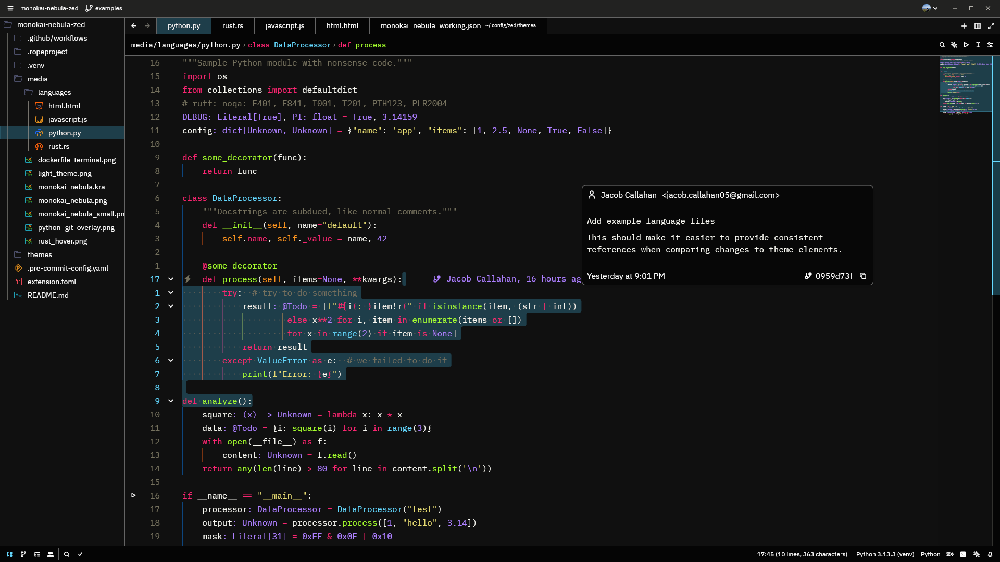
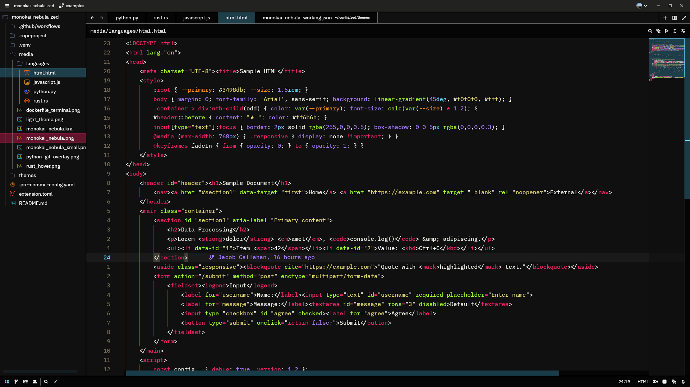
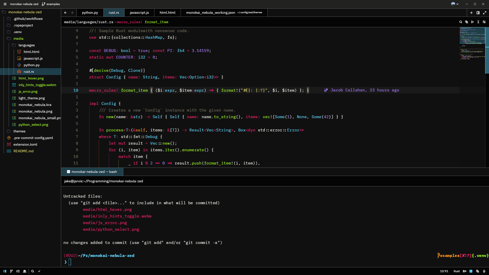
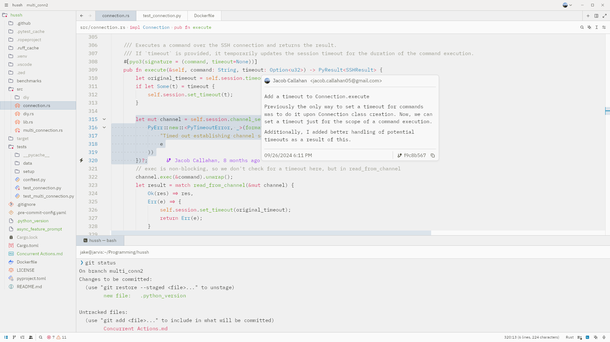
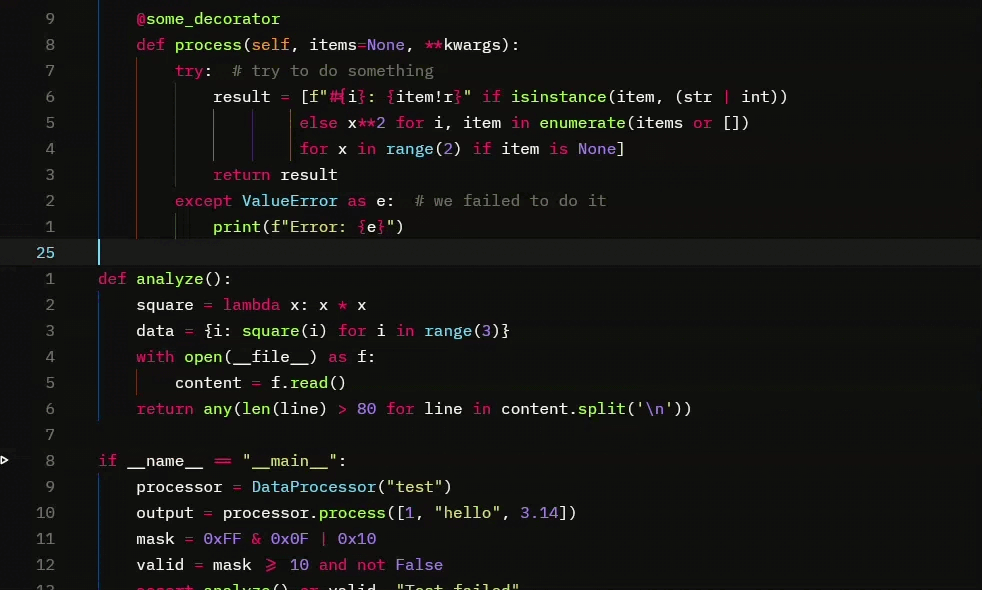

**Monokai Nebula** is deep and vivid Monokai-inspired theme for the Zed editor.

My goal is to improve contrast over many other Monokai themes, while enhancing the overall beauty and readability of text.

This theme provides custom colors for almost every themeable element in the editor, giving way to default values where a more "native" feel is appropriate.
For those that use collaborative editing, up to 5 users will have theme-appropriate colors.

Bright colors over a dark (but not black) background make it easier to read.
Unlike other monokai themes, Nebula treats docstrings like regular comments, reducing visual noise.

Special attention was paid to ensure the terminal follows the same visual consistency.

And for those of you that prefer a light theme, you can choose Monokai Nebula Light.
The light theme really brightens things up, while trying to keep a good amount of contrast; resulting in a "silky" feel.

Inlay hints also look great in this theme! (you may need to view in the media directory)

